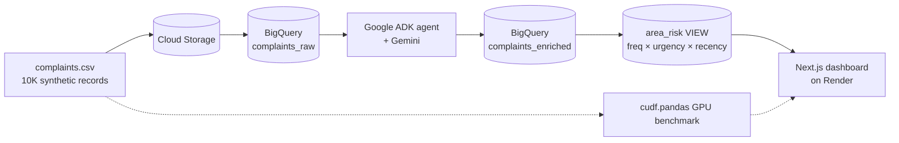

# 🏙️ Civic Pulse

**GenAI-powered civic complaint triage.** Cities receive thousands of unstructured complaints (apps, helplines, Twitter, portals) and triage them manually — urgent public-safety issues drown in the noise, and nobody knows *which neighborhood is about to boil over*. Civic Pulse ingests raw complaints at scale, uses Gemini to classify category, urgency, and sentiment, computes a per-area **risk score**, and puts a live triage dashboard in front of city officials.

## Architecture



Full diagram: [architecture.md](architecture.md)

## Components used

| | |
|---|---|
| **Google Cloud Storage** | Landing zone for raw complaint CSVs (`gs://civic-pulse-data`) |
| **BigQuery** | `complaints_raw`, `complaints_enriched`, `cluster_summaries` tables + `area_risk` view (`risk_score.sql`) |
| **Gemini** | Structured-output classification (category), urgency scoring (1–5), sentiment, cluster summarization |
| **Google ADK** | Agent (`agent.py`) exposing `classify_complaint`, `summarize_cluster`, `sentiment` tools; also runs the batch enrichment pipeline |
| **NVIDIA cudf.pandas** | Zero-code-change GPU acceleration of the pandas cleaning/dedup pipeline (`benchmark.py`) |
| **Next.js dashboard** | `dashboard/` — Next.js 14 + Tailwind + Recharts + Mapbox, API routes query BigQuery via `@google-cloud/bigquery` |

**GPU speedup:** see `speedup.json` after running `benchmark.py` — the identical pandas pipeline (normalize → dedupe → parse timestamps → groupby → merge, ×5) timed on CPU vs `cudf.pandas`. On a T4 this workload typically lands in the **5–15×** range; the dashboard displays the measured number, never a claimed one.

## Setup — data pipeline

```bash
# 0. Prereqs: Python 3.10+, gcloud CLI, a GCP project with BigQuery enabled
pip install -r requirements.txt
gcloud auth application-default login
cp .env.example .env          # fill in GOOGLE_CLOUD_PROJECT + GOOGLE_API_KEY

# 1. Generate 10K synthetic complaints -> complaints.csv
python generate_data.py

# 2. GCS bucket + BigQuery dataset/table
./setup_gcp.sh $GOOGLE_CLOUD_PROJECT

# 3. GPU vs CPU benchmark -> speedup.json
#    (needs NVIDIA GPU; on a CPU-only laptop add --allow-no-gpu)
python benchmark.py

# 4. Gemini enrichment -> complaints_enriched (+ cluster_summaries)
python agent.py --limit 1000      # drop --limit for all 10K rows

# 5. Create the area_risk view
sed "s/PROJECT_ID/$GOOGLE_CLOUD_PROJECT/g" risk_score.sql | bq query --use_legacy_sql=false

# 6. Preflight check — verifies every table/view + credentials
python check_ready.py
```

## Setup — dashboard (local)

```bash
cd dashboard
npm install
cp .env.local.example .env.local   # GOOGLE_CLOUD_PROJECT (+ optional Mapbox token)
npm run dev                        # http://localhost:3000
```

Locally the BigQuery client uses your `gcloud` Application Default Credentials — no service-account key needed.

## Deploy to Render

1. Push this repo to GitHub (`.env*` files are gitignored — commit `speedup.json` so the deployed dashboard can show the benchmark metric).
2. Create a **service account** in GCP (IAM → Service Accounts) with roles **BigQuery Data Viewer** + **BigQuery Job User**, download its JSON key, and base64-encode it:
   `base64 -w0 sa-key.json` (Git Bash/Linux) — copy the output.
3. In Render: **New → Blueprint**, point it at the repo — `render.yaml` provisions the web service (Node runtime, `rootDir: dashboard`, build `npm install && npm run build`, start `npm start`).
4. Set the environment variables in the Render dashboard:
   - `GOOGLE_CLOUD_PROJECT` — your GCP project id
   - `GCP_SA_KEY_BASE64` — the base64 string from step 2
   - `NEXT_PUBLIC_MAPBOX_TOKEN` — optional; without it the map panel falls back to a ranked-area list

> **Free-tier note:** Render's free plan spins the service down after ~15 min idle. The first request after that takes **30–60 s** (cold start) — open the URL a couple of minutes before a demo.

## Risk score

```
risk_score(area) = freq × avg_urgency × days_since_last_complaint
```

frequency of complaints × Gemini-scored average urgency × staleness (how long the area has gone unaddressed since its latest complaint, floored at 1 day).

## Repo map

| File | Purpose |
|---|---|
| `generate_data.py` | Task 1 — synthetic dataset |
| `setup_gcp.sh` | Task 2 — GCS + BigQuery bootstrap |
| `benchmark.py` | Task 3 — pandas vs cudf.pandas, writes `speedup.json` |
| `agent.py` | Task 4 — ADK agent + Gemini batch enrichment |
| `risk_score.sql` | Task 5 — `area_risk` view |
| `dashboard/` | Task 6 — Next.js 14 dashboard (API routes → BigQuery) |
| `render.yaml` | Render blueprint for the dashboard |
| `config.py` | Shared pipeline config; loads `.env`, fails loudly on missing credentials |
| `check_ready.py` | Preflight — verifies data, credentials, tables, view |
