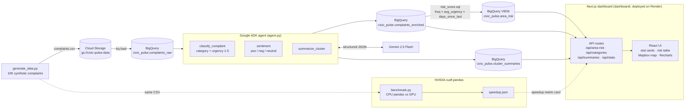

# Civic Pulse — Architecture

## Flow

1. **Ingest** — synthetic complaints CSV lands in GCS, loaded into BigQuery `complaints_raw`.
2. **Accelerate** — `benchmark.py` runs the identical cleaning/dedup pipeline on plain pandas (CPU) and `cudf.pandas` (NVIDIA GPU), emitting the speedup ratio.
3. **Enrich** — the Google ADK agent batch-calls Gemini with structured-output schemas to classify category, score urgency (1–5), and tag sentiment per complaint → `complaints_enriched`; top hotspots get LLM cluster summaries.
4. **Score** — `risk_score.sql` builds the `area_risk` view: `freq × avg_urgency × days_since_last_complaint` per area.
5. **Visualize** — the Next.js dashboard (`dashboard/`, deployed on Render) reads everything live from BigQuery through its API routes: ranked risk table, Mapbox bubble map, category breakdown with click-to-filter, Gemini hotspot summaries, and the GPU speedup metric.
